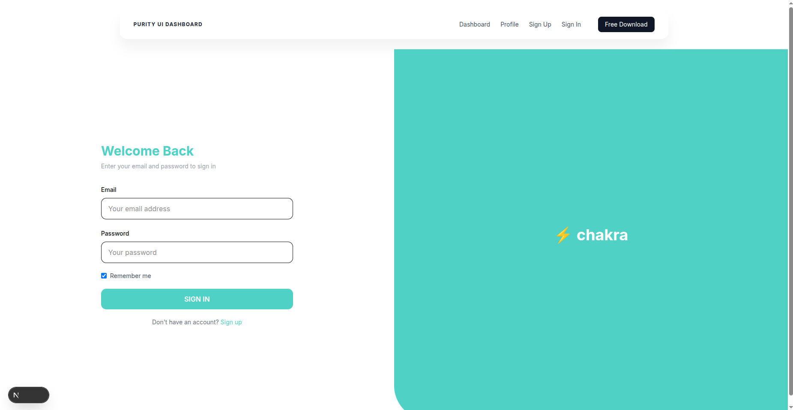
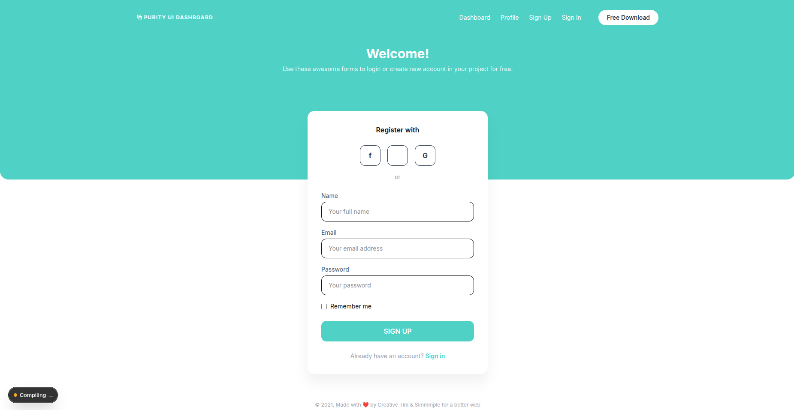
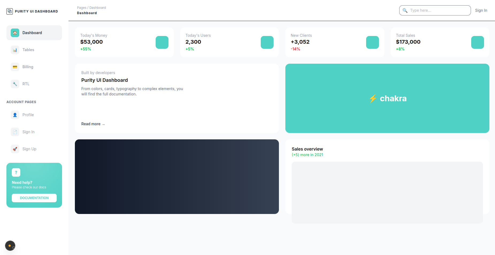
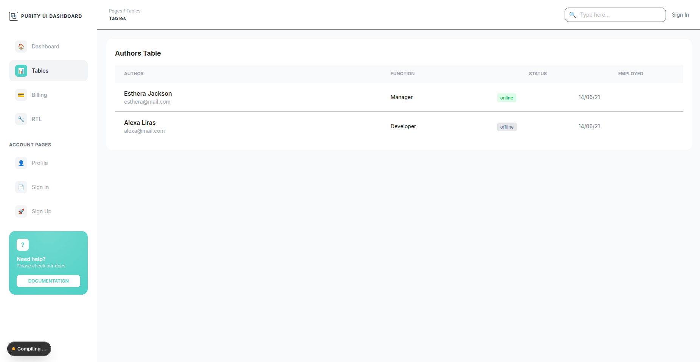
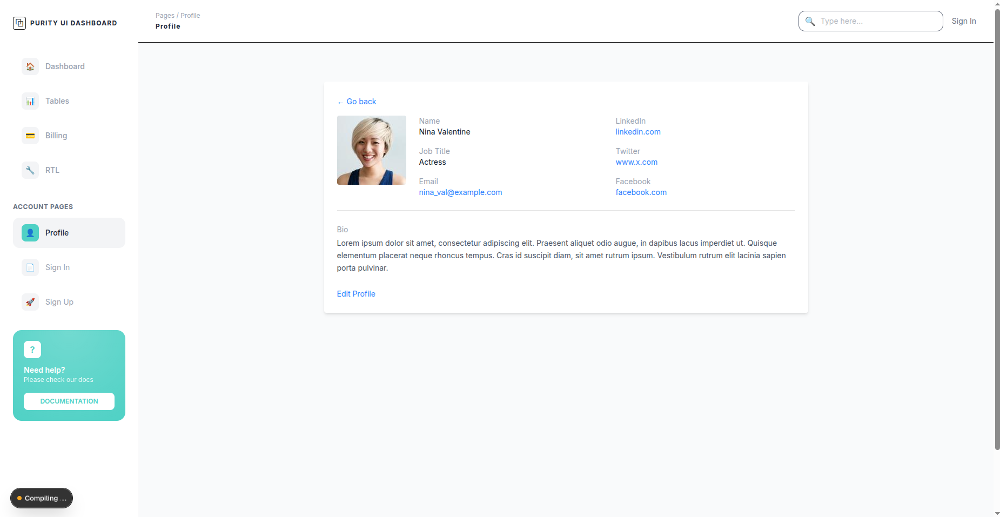

# Day 5 – Capstone Mini Project

## Screenshots

Screenshots of the completed UI for different pages are available in the project.

Pages captured:
## - Landing Page


## - Login Page



## - Signup Page



## - Dashboard



## - Users Page



## - Profile Page




---

## Folder Structure

```
week3-next-tailwind-frontend
│
├── src
│   ├── app
│   │   ├── page.jsx
│   │   ├── layout.jsx
│   │   ├── globals.css
│   │   ├── favicon.ico
│   │   │
│   │   ├── login
│   │   │   └── page.jsx
│   │   │
│   │   ├── signup
│   │   │   └── page.jsx
│   │   │
│   │   ├── about
│   │   │
│   │   ├── dashboard
│   │   │   ├── layout.jsx
│   │   │   ├── page.jsx
│   │   │   ├── users
│   │   │   ├── profile
│   │   │   ├── billing
│   │   │   └── rtl
│   │   │
│   │   ├── public
│   │   │   ├── layout.jsx
│   │   │   └── page.jsx
│   │   │
│   │   └── screenshots
│   │
│   └── components
│       └── ui
│           ├── Navbar.jsx
│           ├── PublicNavbar.jsx
│           ├── Sidebar.jsx
│           ├── Button.jsx
│           ├── Input.jsx
│           ├── Card.jsx
│           ├── Badge.jsx
│           ├── Modal.jsx
│           └── index.js
│
├── public
│   ├── images
│   ├── next.svg
│   ├── vercel.svg
│
├── tailwind.config.js
├── postcss.config.mjs
├── package.json
├── tsconfig.json
└── README.md

```

---

## Components List

Reusable UI components created and used across the application:

- Navbar  
- PublicNavbar  
- Sidebar  
- Button  
- Input  
- Card  
- Badge  
- Modal  

---

## Lessons Learned

- Structuring a real-world Next.js App Router project
- Using nested layouts for dashboard pages
- Separating public and dashboard UI layouts
- Building reusable UI components
- Creating responsive layouts using TailwindCSS
- Maintaining clean and scalable folder structure
