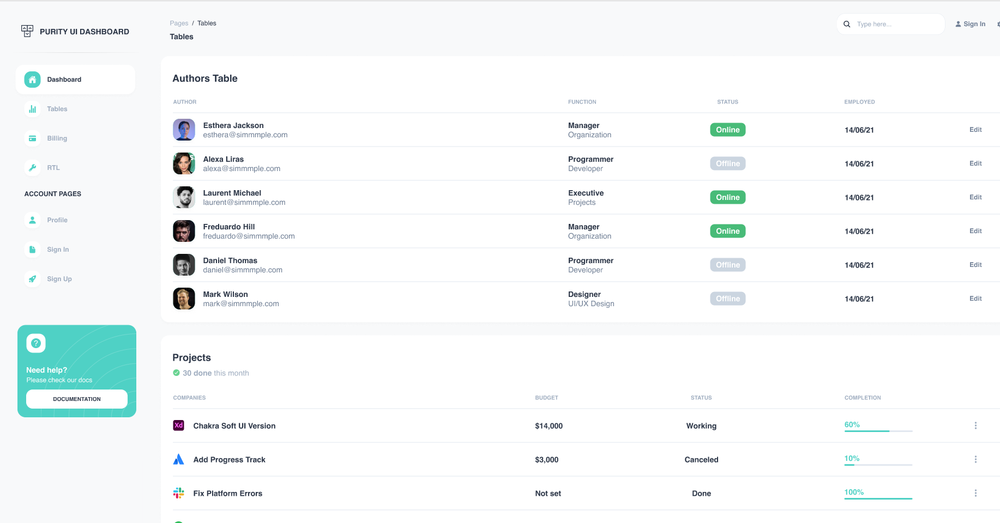

# Purity UI Dashboard (Basic Layout)

This project is a **basic dashboard layout** inspired by the **Purity UI Dashboard** design.  
The focus of this task is **layout structure**, not advanced UI or functionality.

It includes:
- A **Top Navbar**
- A **Left Sidebar**
- A **Main Content Area**

All other UI elements are kept **simple and plain** on purpose.

---

## 🚀 Tech Stack

- **Next.js (App Router)**
- **React**
- **Tailwind CSS**
- **PostCSS**

---

## 📁 Project Folder Structure

```bash
day1/
│
├── app/
│   ├── layout.js        # Root layout (Navbar + Sidebar)
│   ├── page.js          # Main page content
│   ├── globals.css      # Global styles + Tailwind imports
│
├── components/
│   ├── Navbar.jsx       # Top navigation bar
│   ├── Sidebar.jsx      # Left sidebar menu
│
├── postcss.config.js    # PostCSS configuration
├── tailwind.config.js  # Tailwind configuration
├── package.json
└── README.md
```


---

## 🧱 Layout Structure (Important)

The screen is divided into **two main parts**:

| Sidebar | Main Area |


Inside the **Main Area**:

| Navbar |
| Page Content |


---

## 🧭 Navbar Structure

### What the Navbar contains

- **Left** → Project Title (Purity UI Dashboard)
- **Middle** → Page breadcrumb + Page title  
- **Right** → Search input + Sign In text

### Key Design Rule

> The page title (`Pages / Tables` → `Tables`)  
> is **NOT centered on the screen**  
> It is **left-aligned inside the main content area**

This matches the original **Purity UI Dashboard** design.

---

## 🧭 Sidebar Structure

The sidebar contains:

- Dashboard
- Tables
- Billing
- RTL
- Account Pages
  - Profile
  - Sign In
  - Sign Up

The sidebar:
- Has **fixed width**
- Uses **simple font and spacing**
- Matches the reference design’s font size and alignment

---

## 🎨 Styling Approach

- **Tailwind CSS** is used for styling
- No custom CSS except `globals.css`
- Utility-first approach (spacing, fonts, borders)

Example Tailwind usage:
- `flex` → layout
- `w-56` → sidebar width
- `pl-6` → content alignment
- `border-b` → navbar separator

---

## 📄 globals.css

```css
@tailwind base;
@tailwind components;
@tailwind utilities;
```
This file:

Enables Tailwind globally

Is imported automatically by layout.js

⚙️ PostCSS Configuration

PostCSS is used to process Tailwind styles.

postcss.config.js

```
const config = {
  plugins: {
    "@tailwindcss/postcss": {},
  },
};

export default config;
```
▶️ Running the Project
```
npm install
npm run dev
```
Then open:
```
http://localhost:3000
```

## Project will run smoothly

### Given UI figma image



### The UI that is created by my(NavBar + SideBar)


