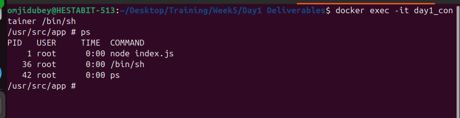
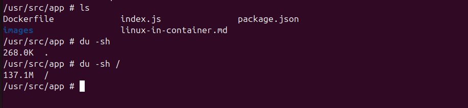
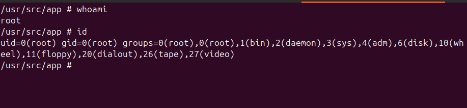
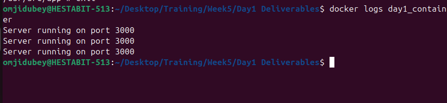
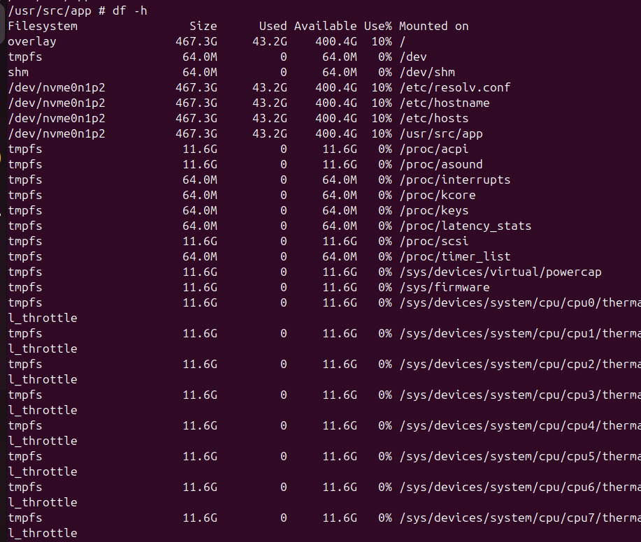

# Linux Inside Docker Container

## Process Management
- `ps` shows running processes
- PID 1 is Node app

## Filesystem
- Minimal Linux filesystem
- No systemd or cron

## Users
- Default user is root
- Permissions still apply

## Logs
- Stdout/stderr captured by Docker
- Viewed using `docker logs`

## Disk
- Container filesystem is ephemeral
- Volumes needed for persistence

