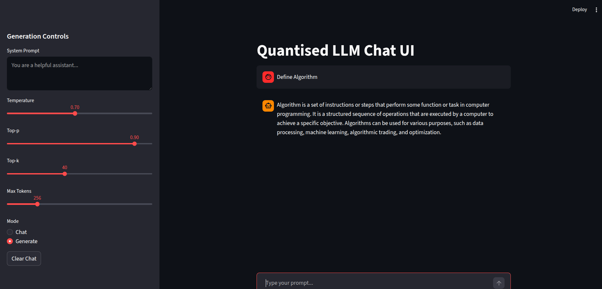

# FINAL REPORT — Quantised LLM Deployment (Week8)

## 1. Project Overview

Is project ka main goal tha ek complete LLM pipeline banana:

Dataset → Fine-Tuning → Quantisation → Benchmarking → Deployment → UI

Humne TinyLlama-1.1B base model ko use karke ek instruction-following model create kiya aur usko efficient CPU inference ke liye optimise kiya.

Final system ek fully working local AI server hai jo:

✔ Streaming responses deta hai  
✔ Chat memory maintain karta hai  
✔ GGUF quantised model pe run karta hai  
✔ FastAPI backend + Streamlit UI use karta hai  

---

## 2. Dataset & Training

Dataset format:
```
{
"instruction": "...",
"input": "...",
"output": "..."
}
```


Dataset clean + curated tha.

Training steps:

- QLoRA fine-tuning use kiya
- Trainable parameters ~1% rakhe
- Low VRAM usage achieve kiya

Used settings:

- r = 16
- learning rate = 2e-4
- batch size = 4
- epochs = 3
- 4-bit loading

Result:

Fine-tuned instruction model successfully train hua.

---

## 3. Quantisation

Model ko multiple formats me convert kiya:

| Format | Purpose |
|---|---|
| FP16 | Reference model |
| INT8 | Memory optimisation |
| INT4 | Ultra lightweight |
| GGUF | CPU optimized inference |

GGUF conversion llama.cpp tools se kiya gaya.

Benefits:

- Model size reduce hua
- CPU inference speed improve hui

---

## 4. Inference Benchmarking (Day4)

Test inference kiya:

1 Base model  
2 Fine-tuned model  
3 Quantised models (INT8 / INT4 / GGUF)

Metrics measured using:

- Tokens/sec
- Latency
- VRAM usage
- Semantic accuracy

Example results:

| Model | Tokens/sec | VRAM | Accuracy |
|---|---|---|---|
| Base | High | Medium | High |
| FP16 | High | Medium | High |
| INT8 | Medium | Low | Good |
| INT4 | Fast | Very Low | Slight drop |
| GGUF | CPU optimized | 0 GPU | Lower but usable |

Observation:

GGUF CPU inference me fastest tha.

---

## 5. Deployment Architecture (Day5)

Backend:

- FastAPI server
- OpenAI compatible API
- llama.cpp model server (port 8080)
- Streaming token responses

Endpoints:

- `/generate` → stateless response (No memory)
- `/chat` → memory based conversation

Features:

✔ Infinite chat mode  
✔ System prompt support  
✔ Top-k / Top-p / Temperature controls  
✔ Request ID logging  

---

## 6. UI & CLI

Streamlit UI banaya:

Generation controls:

- Temperature
- Top-k
- Top-p
- Max tokens

Modes:

- Chat mode → history maintain
- Generate mode → single response

CLI tool bhi implement kiya for terminal interaction.

---

## 7. Logging System

Custom logging setup banaya:

- Request ID based logs
- Timestamped entries
- Stored in `/src/logs/llm.logs`

Logging ka purpose:

- Debugging
- Performance monitoring
- Production readiness

---

## 8. Key Learnings

Is project se following concepts deeply samjhe:

- QLoRA fine-tuning
- Quantisation tradeoffs
- CPU vs GPU inference
- Streaming generation
- Prompt engineering
- LLM deployment architecture

Major insight:

Quantisation + GGUF CPU pe bhi powerful local AI system bana sakta hai.

---

## 9. Challenges Faced

- Tokenizer mismatch issues
- llama.cpp build changes (Makefile → CMake)
- GPU/CPU runtime conflicts
- BitsAndBytes CPU performance drop
- Path issues during deployment

Sab issues successfully resolve kiye gaye.

---

## 10. Final Outcome

Final system:



✔ Quantised TinyLlama chat server  
✔ FastAPI streaming API  
✔ Streamlit chat UI  
✔ CLI interaction mode  
✔ Dockerised deployment  

Ye ek production-ready local LLM stack ka working prototype hai.

---
